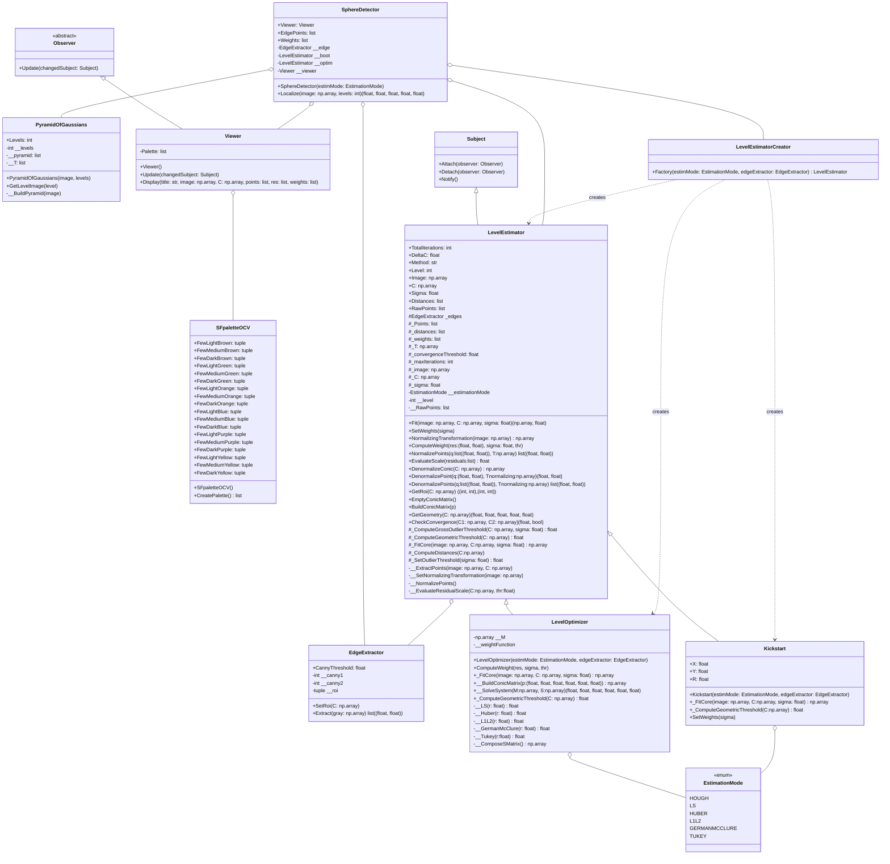

# Sphere Detector

**Author:** Dario Comanducci  

## Description

This Python project implements a system for the accurate detection and estimation of a sphere in digital images (a first step for a photometric-stereo application, where the sphere acts as a calibration device).  
It uses a multi-resolution approach (Gaussian pyramid) and several robust optimization techniques to refine the sphere localization and parameters, starting from an initialization based on the Hough transform for circles.
Mathematical explanation is provided in ./docs/SphereDetector.pdf, while UML class diagram is available in ClassDiagram.pdf.

## Repository Structure
SphereDetector/  
│  
├── src/  
│   ├── __init__.py  
│   ├── EdgeExtractor.py  
│   ├── EstimationMode.py  
│   ├── Kickstart.py  
│   ├── LevelEstimator.py  
│   ├── LevelEstimatorCreator.py  
│   ├── LevelOptimizer.py  
│   ├── MAIN_SphereDetector.py  
│   ├── Observer.py  
│   ├── PyramidOfGaussians.py  
│   ├── Settings.py  
│   ├── SphereDetector.py  
│   ├── Subject.py  
│   └── Viewer.py  
│  
├── data/  
│   ├── DSC_3112.JPG  
│   └── DSC_5165.JPG  
│  
├── docs/  
│   ├── SphereDetector.pdf  
│   └── ClassDiagram.pdf  
│  
├── outputs/  some images saved manually by OpenCV window  
│  
├── requirements.txt  
└── README.md  

### Class diagram  

